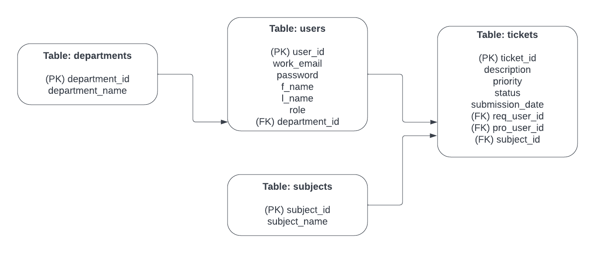

# <u>PROJECT 2 - {{ titlePending }}</u>

### <u>Team Members</u>: Caleb Beck, Byron Fedele, Issiaka Kone, Handerson Coq, & Sammy Box
# IT Helpdesk - an IT Ticketing Service
- <b>Description:</b> An IT Ticketeting API that allows employees of {{COMPANY NAME}} to create and manage IT tickets
for their IT issues. The admin can appoint technicians (ITPros) that will confirm/process/resolve tickets based on
their priority level. The Admin can also create/edit/delete departments
  
- <b>Possible External APIs:</b>
  - Google Login API*
  - Profile Generator API
  - Analytic Graphics API 
  - Google Messaging API (depreciated)
  
- <b>User Stories</b>
  1. Any user can register a new account/Users can update/delete their account (User,ITPro,Admin)
  2. Any registered user can login/logout
  3. Any registered user can Create/Update/Resolve their tickets from the database
  4. Any registered user can set the priority/subject of their ticket (default, low-priority, high-priority)
  5. Any registered user can Check the status of any of THEIR tickets (Pending,Confirmed,In-Progress,Resolved)
  6. Any ITPro/Admin can view/confirm/resolve an active ticket
  7. Any ITPro/Admin can filter their Ticket view by subject/date/priority
  8. Any ITPro/Admin can update a ticket's subject/priority
  9. Any ticket that HASN'T been resolved when the ITPro/Admin logs out/deletes their account will return to the ticket pool
  10. Any Admin can update a member's role (ITPro,User,Admin)
  
- <b>REACH GOALS</b>
  - Implement a messaging service that lets users communicate with an ITPro associated with their Ticket
  - After 24hrs, if ticket hasn't been resolved, it bumps up in priority
  
- <b>Entity Relationship Diagram</b>
  - TABLES:
    - Users -> {(PK) user_id, work_email, password, f_name, l_name, role, (FK) department_id}
    - Subjects -> {(PK) subject_id, subject_name}
    - Departments -> {(PK) department_id, department_name}
    - Tickets -> {(PK) ticket_id, (FK) req_user_id, (FK) pro_user_id, submission_date, (FK) subject_id, description, priority, status}
  - ERD:

  